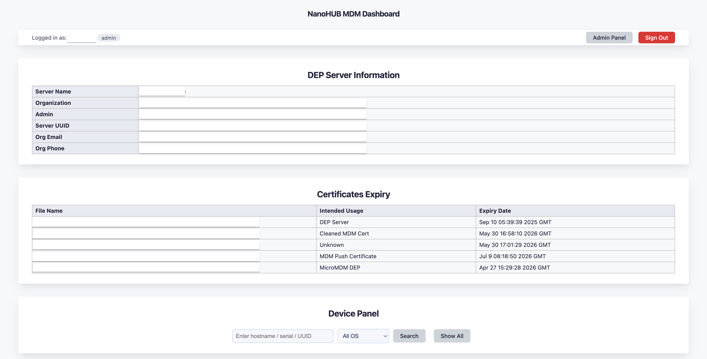
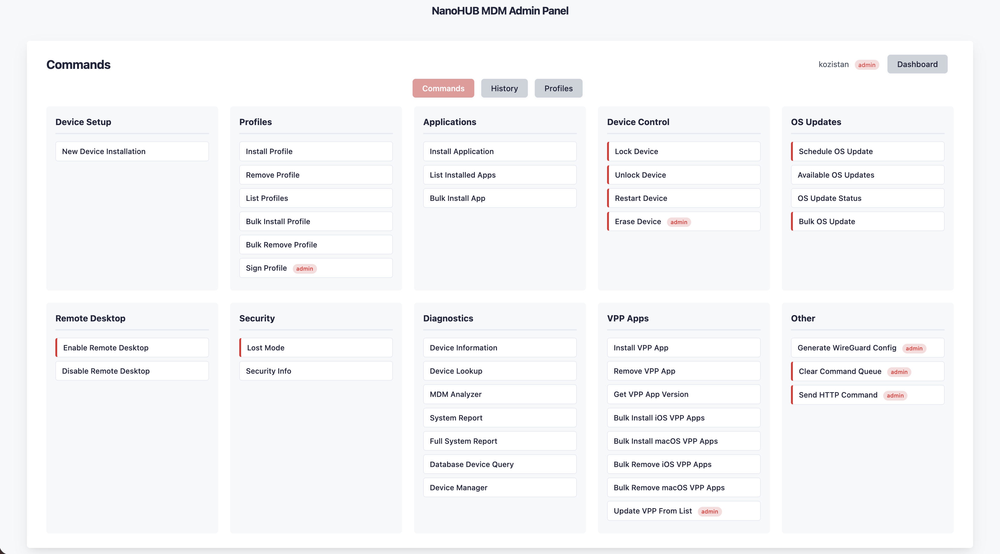
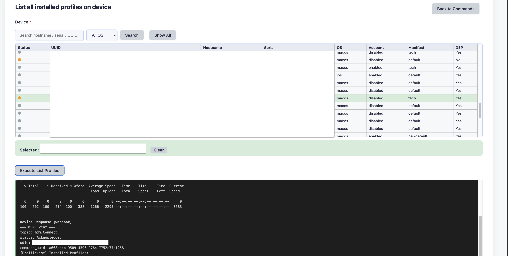
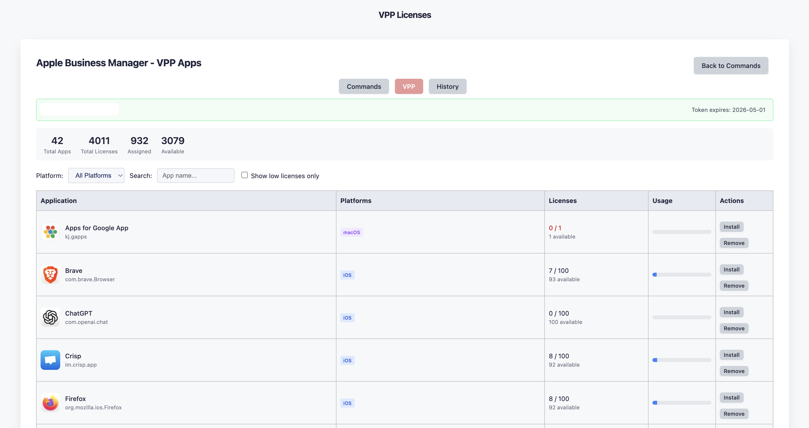
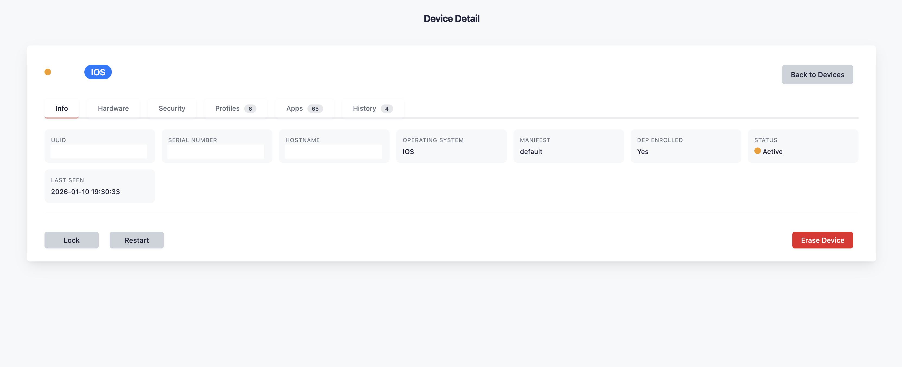

# NanoHUB MDM Dashboard

Web-based management dashboard for Apple MDM (Mobile Device Management) using NanoHUB backend with LDAP authentication and comprehensive admin panel.

## Features

### Core Features
- **Multi-Auth Support**: Google SSO, LDAP/AD, and local fallback authentication
- **Google SSO**: OAuth 2.0 Single Sign-On via Google Workspace
- **LDAP Authentication**: Active Directory login with role-based access control
- **SQL-Based Device Management**: Fast, scalable MySQL device database
- **Real-time Device Status**: Online/Active/Offline status indicators
- **Device Search**: Search by UUID, serial number, or hostname
- **Parallel Execution**: 10-20x faster bulk operations with race condition fixes
- **DDM Support**: Declarative Device Management with KMFDDM integration

### Admin Panel
- **Device Setup**: DB-driven installation workflows for new devices
- **Profiles**: Install, remove, list profiles
- **Applications**: App installation, Manage Applications (DB CRUD)
- **Device Control**: Lock, unlock, restart, erase
- **OS Updates**: OS update management
- **Remote Desktop**: Enable/disable remote access
- **Security**: Lost mode, security info
- **Diagnostics**: Device info, MDM analyzer
- **VPP Apps**: VPP license management
- **Database Tools**: Device inventory operations
- **DDM**: Declarative Device Management

### Modular Architecture
- **Package Structure**: Admin panel split into separate modules
- **nanohub_admin_core.py** (~43 lines): Blueprint registration only
- **nanohub_admin/core.py** (~1290 lines): Shared functions (device data, audit, VPP)
- **nanohub_admin/commands.py** (~3040 lines): All execute_* command handlers
- **nanohub_admin/profiles.py** (~650 lines): Profile management page and API
- **nanohub_admin/routes/**: Modular route blueprints
  - `dashboard.py` - Commands page, command execution (~950 lines)
  - `history.py` - Command execution history (~320 lines)
  - `devices.py` - Device list & detail pages (~1710 lines)
  - `settings.py` - Settings page and configuration (~1310 lines)
  - `reports.py` - Reports and statistics (~2760 lines)
  - `vpp.py` - VPP/App management (~1820 lines)
  - `ddm.py` - DDM management (~1520 lines)
  - `help.py` - Help documentation
- **Manifest Management**: Database-backed manifests with CRUD operations
- **User Role Management**: Database-stored role overrides with CLI tool

### VPP Panel
- **Token Management**: VPP token status with expiration warnings
- **License Overview**: Total apps, licenses, assigned/available counts
- **App Browser**: Visual app list with icons from iTunes API
- **Filtering**: By platform (iOS/macOS), search by name, low license alerts
- **Install/Remove**: Direct app installation and removal to selected devices

### Command History
- **MySQL Storage**: Persistent command history with 90-day retention
- **Detailed Logging**: Command name, parameters, device info, results
- **Filtering**: By date range, device, user, success/failure status
- **Pagination**: Browse through historical commands
- **Automatic Cleanup**: Daily cleanup of records older than 90 days

### Device Detail Panel
- **Device Card**: Comprehensive device information page (`/admin/device/<uuid>`)
- **Database Caching**: MDM data cached in MySQL (like Jamf) for instant access
- **Tab Interface**: Info, Hardware, Security, Profiles, Apps, History tabs
- **Quick Actions**: Lock, Restart, Erase directly from device page
- **Update Inventory**: Bulk inventory update command with filters
  - OS filter (macOS/iOS)
  - Manifest filter (dynamic list)
  - Last Updated filter (24h, 7 days, never)
- **Daily Cron**: Automatic inventory refresh at 14:00

### VPP Updates Dashboard
- **Automatic App Updates**: Compare installed vs expected versions from JSON manifests
- **Dashboard UI**: `/admin/vpp/updates` with device selection and filters
- **Database-Driven**: Reads cached app data from device_details table (no device polling)
- **Filters**: By OS (macOS/iOS), Manifest, device search
- **Actions**:
  - Check Updates: Dry-run to see which apps need updates
  - Apply Updates: Queue InstallApplication commands for outdated apps
  - Refresh Apps Data: Request fresh InstalledApplicationList from devices
  - Manage Apps: Edit managed apps JSON manifest
- **Smart Queue**: Replaces pending InstallApplication commands with latest version
- **Force Install**: Option to reinstall all managed apps regardless of version
- **Batch Script**: `update_vpp_from_db` for automated cron execution with Telegram reports
- **Cron Schedule**: Daily at 03:00 (Mon-Fri)

### Role-Based Access Control

**Authentication Methods:**

| Method | Description |
|--------|-------------|
| Google SSO | OAuth 2.0 via Google Workspace (primary when configured) |
| LDAP/AD | Active Directory domain login |
| Local User | Fallback admin account (hdadmin) |

**LDAP Group Mapping:**

| AD Group | Role | Access |
|----------|------|--------|
| `it` | admin | Full access to all devices |
| `mdm-admin` | admin | Full access to all devices |
| `mdm-restricted-admin` | restricted-admin | Full access, filtered by manifest |
| `mdm-operator` | operator | Device management, profiles, apps |
| `mdm-report` | report | Read-only access |

**Google SSO:** Default role is `operator`. Use database role overrides for custom permissions.

### Advanced Features
- **Manifest Filtering**: Restrict admin access to specific device groups
- **Device Manager**: Add/Update/Delete devices via web interface
- **Audit Logging**: Complete audit trail for all admin actions
- **Bulk Operations**: Execute commands on multiple devices simultaneously
- **Parallel Execution**: All bulk scripts execute commands in parallel for 10-20x speed improvement
- **Bulk Remote Desktop**: Enable/disable Remote Desktop on multiple macOS devices with device selection

## Screenshots

### Main Dashboard


### Admin Panel


### Profile_list command on Admin Panel


### VPP Panel


### Device Detail Panel


## Architecture

```
┌─────────────────┐         ┌──────────────────┐         ┌─────────────────┐
│  Web Frontend   │────────▶│  Flask Web       │────────▶│   NanoMDM       │
│  (HTML/CSS/JS)  │         │  (nanohub_web)   │         │   Backend       │
└─────────────────┘         └──────────────────┘         └─────────────────┘
        │                           │
        │                   ┌───────┴───────┐
        │                   │               │
        ▼                   ▼               ▼
┌─────────────────┐  ┌─────────────┐  ┌─────────────┐
│  Admin Panel    │  │   LDAP/AD   │  │   MySQL     │
│  (nanohub_admin)│  │   Auth      │  │   Database  │
└─────────────────┘  └─────────────┘  └─────────────┘
```

## Prerequisites

- Python 3.8+
- MySQL/MariaDB database
- Active Directory (for LDAP authentication)
- Nginx (reverse proxy)
- NanoMDM server (running)
- systemd (service management)

## Installation

### 1. Clone Repository

```bash
git clone https://github.com/kozistan/nanohub-mdm-dashboard.git
cd nanohub-mdm-dashboard
```

### 2. Create Virtual Environment

```bash
python3 -m venv /opt/nanohub/venv
source /opt/nanohub/venv/bin/activate
pip install -r requirements.txt
```

### 3. Configure Environment

Create environment file `/opt/nanohub/backend_api/nanohub_environment`:

```bash
# LDAP Configuration
LDAP_HOST=dc01.example.com
LDAP_HOST_FAILOVER=dc02.example.com
LDAP_BIND_DN=CN=ldapadmin,OU=Admins,DC=example,DC=com
LDAP_BIND_PASSWORD=your_ldap_password
LDAP_BASE_DN=DC=example,DC=com

# Database Configuration
DB_HOST=localhost
DB_USER=nanohub
DB_PASSWORD=your_db_password
DB_NAME=nanohub

# Flask Configuration
FLASK_SECRET_KEY=your-secret-key-change-in-production

# Paths
DASHBOARD_INDEX_PATH=/var/www/mdm-web/index.html
PROFILES_DIR=/opt/nanohub/profiles/
COMMANDS_DIR=/opt/nanohub/tools/api/commands
```

### 4. Install Files

```bash
# Backend API
sudo mkdir -p /opt/nanohub/backend_api
sudo cp opt/nanohub/backend_api/*.py /opt/nanohub/backend_api/

# Web frontend
sudo mkdir -p /var/www/mdm-web/static
sudo cp var/www/mdm-web/index.html /var/www/mdm-web/
sudo cp var/www/mdm-web/static/dashboard.css /var/www/mdm-web/static/

# Systemd services
sudo cp etc/systemd/system/nanohub-web.service /etc/systemd/system/
sudo cp etc/systemd/system/mdm-flask-api.service /etc/systemd/system/
```

### 5. Set Permissions

```bash
# Environment file (contains secrets)
sudo chmod 600 /opt/nanohub/backend_api/nanohub_environment

# Backend files
sudo chmod 755 /opt/nanohub/backend_api/*.py

# Web files
sudo chmod 644 /var/www/mdm-web/index.html
sudo chmod 644 /var/www/mdm-web/static/dashboard.css
```

### 6. Configure Database

```sql
CREATE DATABASE IF NOT EXISTS nanohub;
CREATE USER IF NOT EXISTS 'nanohub'@'localhost' IDENTIFIED BY 'your_password';
GRANT ALL PRIVILEGES ON nanohub.* TO 'nanohub'@'localhost';

-- Device inventory table
CREATE TABLE IF NOT EXISTS device_inventory (
    id INT AUTO_INCREMENT PRIMARY KEY,
    uuid VARCHAR(255) UNIQUE NOT NULL,
    serial VARCHAR(127),
    os VARCHAR(10),
    hostname VARCHAR(127),
    manifest VARCHAR(127) DEFAULT 'default',
    account VARCHAR(20) DEFAULT 'disabled',
    dep VARCHAR(20) DEFAULT '0',
    created_at TIMESTAMP DEFAULT CURRENT_TIMESTAMP,
    updated_at TIMESTAMP DEFAULT CURRENT_TIMESTAMP ON UPDATE CURRENT_TIMESTAMP,
    INDEX idx_hostname (hostname),
    INDEX idx_serial (serial),
    INDEX idx_manifest (manifest),
    INDEX idx_os (os)
);

-- Command history table
CREATE TABLE IF NOT EXISTS command_history (
    id INT AUTO_INCREMENT PRIMARY KEY,
    timestamp DATETIME NOT NULL DEFAULT CURRENT_TIMESTAMP,
    user VARCHAR(100) NOT NULL,
    command_id VARCHAR(100) NOT NULL,
    command_name VARCHAR(255) NOT NULL,
    device_udid VARCHAR(100),
    device_serial VARCHAR(50),
    device_hostname VARCHAR(255),
    params TEXT,
    result_summary TEXT,
    success TINYINT(1) NOT NULL DEFAULT 0,
    execution_time_ms INT,
    INDEX idx_timestamp (timestamp),
    INDEX idx_device_udid (device_udid),
    INDEX idx_device_serial (device_serial),
    INDEX idx_device_hostname (device_hostname),
    INDEX idx_user (user),
    INDEX idx_command_id (command_id)
);

-- Audit log table
CREATE TABLE IF NOT EXISTS admin_audit_log (
    id INT AUTO_INCREMENT PRIMARY KEY,
    timestamp TIMESTAMP DEFAULT CURRENT_TIMESTAMP,
    username VARCHAR(255),
    action VARCHAR(255),
    command VARCHAR(255),
    params TEXT,
    result TEXT,
    success BOOLEAN,
    INDEX idx_timestamp (timestamp),
    INDEX idx_username (username)
);

-- Device details cache
CREATE TABLE IF NOT EXISTS device_details (
    id INT AUTO_INCREMENT PRIMARY KEY,
    uuid VARCHAR(255) NOT NULL UNIQUE,
    hardware_data JSON,
    security_data JSON,
    profiles_data JSON,
    apps_data JSON,
    ddm_data JSON,
    hardware_updated_at TIMESTAMP NULL,
    security_updated_at TIMESTAMP NULL,
    profiles_updated_at TIMESTAMP NULL,
    apps_updated_at TIMESTAMP NULL,
    ddm_updated_at TIMESTAMP NULL,
    created_at TIMESTAMP DEFAULT CURRENT_TIMESTAMP,
    updated_at TIMESTAMP DEFAULT CURRENT_TIMESTAMP ON UPDATE CURRENT_TIMESTAMP,
    INDEX idx_uuid (uuid)
);

-- Manifests table
CREATE TABLE IF NOT EXISTS manifests (
    id INT AUTO_INCREMENT PRIMARY KEY,
    name VARCHAR(255) NOT NULL UNIQUE,
    description TEXT,
    created_at TIMESTAMP DEFAULT CURRENT_TIMESTAMP,
    created_by VARCHAR(255),
    INDEX idx_name (name)
);

-- User roles table
CREATE TABLE IF NOT EXISTS user_roles (
    id INT AUTO_INCREMENT PRIMARY KEY,
    username VARCHAR(100) NOT NULL UNIQUE,
    role VARCHAR(50) NOT NULL DEFAULT 'report',
    manifest_filter VARCHAR(100) DEFAULT NULL,
    is_active TINYINT(1) DEFAULT 1,
    created_at TIMESTAMP DEFAULT CURRENT_TIMESTAMP,
    updated_at TIMESTAMP DEFAULT CURRENT_TIMESTAMP ON UPDATE CURRENT_TIMESTAMP,
    created_by VARCHAR(100) DEFAULT NULL,
    notes TEXT DEFAULT NULL,
    INDEX idx_username (username),
    INDEX idx_role (role)
);

-- Required profiles table
CREATE TABLE IF NOT EXISTS required_profiles (
    id INT AUTO_INCREMENT PRIMARY KEY,
    manifest VARCHAR(127) NOT NULL,
    os VARCHAR(10) NOT NULL,
    profile_identifier VARCHAR(255) NOT NULL,
    profile_filename VARCHAR(255) DEFAULT NULL,
    install_order INT DEFAULT 100,
    is_optional TINYINT(1) DEFAULT 0,
    variant_group VARCHAR(50) DEFAULT NULL,
    variant_value VARCHAR(50) DEFAULT NULL,
    created_at TIMESTAMP DEFAULT CURRENT_TIMESTAMP,
    UNIQUE KEY unique_manifest_os_profile (manifest, os, profile_identifier),
    INDEX idx_manifest (manifest),
    INDEX idx_os (os)
);

-- Required applications table
CREATE TABLE IF NOT EXISTS required_applications (
    id INT AUTO_INCREMENT PRIMARY KEY,
    manifest VARCHAR(127) NOT NULL,
    os VARCHAR(10) NOT NULL,
    app_name VARCHAR(255) NOT NULL,
    manifest_url VARCHAR(500) NOT NULL,
    install_order INT DEFAULT 100,
    is_optional TINYINT(1) DEFAULT 0,
    created_at TIMESTAMP DEFAULT CURRENT_TIMESTAMP,
    INDEX idx_manifest (manifest),
    INDEX idx_os (os)
);

-- DDM Declarations table
CREATE TABLE IF NOT EXISTS declarations (
    id INT AUTO_INCREMENT PRIMARY KEY,
    identifier VARCHAR(255) NOT NULL UNIQUE,
    type VARCHAR(255) NOT NULL,
    payload JSON,
    server_token VARCHAR(255) DEFAULT NULL,
    uploaded_at TIMESTAMP NULL,
    created_at TIMESTAMP DEFAULT CURRENT_TIMESTAMP,
    updated_at TIMESTAMP DEFAULT CURRENT_TIMESTAMP ON UPDATE CURRENT_TIMESTAMP,
    INDEX idx_identifier (identifier),
    INDEX idx_type (type)
);

-- DDM Sets table
CREATE TABLE IF NOT EXISTS declaration_sets (
    id INT AUTO_INCREMENT PRIMARY KEY,
    set_name VARCHAR(255) NOT NULL UNIQUE,
    description TEXT,
    server_token VARCHAR(255) DEFAULT NULL,
    uploaded_at TIMESTAMP NULL,
    created_at TIMESTAMP DEFAULT CURRENT_TIMESTAMP,
    updated_at TIMESTAMP DEFAULT CURRENT_TIMESTAMP ON UPDATE CURRENT_TIMESTAMP,
    INDEX idx_set_name (set_name)
);

-- DDM Set-Declaration mappings
CREATE TABLE IF NOT EXISTS set_declarations (
    id INT AUTO_INCREMENT PRIMARY KEY,
    set_id INT NOT NULL,
    declaration_id INT NOT NULL,
    created_at TIMESTAMP DEFAULT CURRENT_TIMESTAMP,
    UNIQUE KEY unique_set_declaration (set_id, declaration_id),
    FOREIGN KEY (set_id) REFERENCES declaration_sets(id) ON DELETE CASCADE,
    FOREIGN KEY (declaration_id) REFERENCES declarations(id) ON DELETE CASCADE
);

-- DDM Required Sets - manifest assignments
CREATE TABLE IF NOT EXISTS ddm_required_sets (
    id INT AUTO_INCREMENT PRIMARY KEY,
    manifest VARCHAR(127) NOT NULL,
    os VARCHAR(10) NOT NULL,
    set_id INT NOT NULL,
    created_at TIMESTAMP DEFAULT CURRENT_TIMESTAMP,
    UNIQUE KEY unique_manifest_os (manifest, os),
    INDEX idx_manifest (manifest),
    FOREIGN KEY (set_id) REFERENCES declaration_sets(id) ON DELETE CASCADE
);
```

### 7. Configure Nginx

```nginx
server {
    listen 8000 ssl;
    server_name mdm.example.com;

    ssl_certificate /path/to/cert.pem;
    ssl_certificate_key /path/to/key.pem;

    # Flask Web Frontend (with LDAP auth)
    location / {
        proxy_pass http://127.0.0.1:9007;
        proxy_set_header Host $host;
        proxy_set_header X-Real-IP $remote_addr;
        proxy_set_header X-Forwarded-For $proxy_add_x_forwarded_for;
        proxy_set_header X-Forwarded-Proto $scheme;
    }

    # Static files
    location /static/ {
        alias /var/www/mdm-web/static/;
        expires 1d;
    }

    # API endpoints (for legacy compatibility)
    location /api/ {
        proxy_pass http://127.0.0.1:9006/api/;
        proxy_set_header Host $host;
        proxy_set_header X-Real-IP $remote_addr;
    }
}
```

### 8. Start Services

```bash
sudo systemctl daemon-reload
sudo systemctl enable nanohub-web mdm-flask-api
sudo systemctl start nanohub-web mdm-flask-api
sudo systemctl restart nginx

# Verify services
systemctl status nanohub-web mdm-flask-api
```

## Configuration

### LDAP Groups

Configure AD groups in `nanohub_ldap_auth.py`:

```python
GROUP_ROLE_MAPPING = {
    'it': 'admin',
    'mdm-admin': 'admin',
    'mdm-restricted-admin': 'restricted-admin',
    'mdm-operator': 'operator',
    'mdm-report': 'report',
}

# Manifest filters for restricted roles
ROLE_MANIFEST_FILTER = {
    'restricted-admin': 'site-%',  # Only sees devices with site-* manifests
}
```

### Adding New Roles

To add a new restricted admin role:

1. Create AD group (e.g., `mdm-site-admin`)
2. Add to `GROUP_ROLE_MAPPING`: `'mdm-site-admin': 'site-admin'`
3. Add to `ROLE_PERMISSIONS`: `'site-admin': ['admin', 'operator', 'report', ...]`
4. Add manifest filter: `ROLE_MANIFEST_FILTER['site-admin'] = 'site-%'`
5. Update role hierarchy in `command_registry.py`
6. Restart nanohub-web service

## Usage

### Access Points

- **Main Dashboard**: `https://mdm.example.com:8000/`
- **Admin Panel**: `https://mdm.example.com:8000/admin`
- **Command History**: `https://mdm.example.com:8000/admin/history`
- **VPP Panel**: `https://mdm.example.com:8000/admin/vpp`
- **DDM Panel**: `https://mdm.example.com:8000/admin/ddm`
- **Device Detail**: `https://mdm.example.com:8000/admin/device/<uuid>`
- **Profiles**: `https://mdm.example.com:8000/admin/profiles`
- **Reports**: `https://mdm.example.com:8000/admin/reports`
- **Help**: `https://mdm.example.com:8000/admin/help`
- **Login**: `https://mdm.example.com:8000/login`

### Admin Panel Operations

1. Login with AD credentials
2. Navigate to Admin Panel
3. Select category and command
4. Fill in required parameters
5. Execute command
6. View results

### VPP Panel

1. Navigate to VPP tab in Admin Panel
2. View license counts and token expiration
3. Filter apps by platform or search
4. Click Install/Remove on any app
5. Select target devices in modal
6. Execute action

### Device Manager

- **ADD**: Create new device in inventory
- **UPDATE**: Modify existing device properties
- **DELETE**: Remove device from inventory

### New Device Installation

**Database-driven** workflow for provisioning new devices. Profiles and applications are loaded from `required_profiles` and `required_applications` tables.

1. Select manifest (device group)
2. Select device
3. Configure wildcard profiles:
   - Account: Disabled (default), Enabled, or Skip
   - Restrictions: Standard, iCloudSync, LevelC, or Skip (macOS)
4. Select applications (checkboxes, loaded from DB)
5. Configure optional settings (WiFi, FileVault, Directory Services, WireGuard)
6. Execute - installs all required profiles and selected applications

### Manage Applications

Admin command for managing applications in database:

- **LIST**: Show all applications grouped by manifest
- **ADD**: Add new application (manifest, OS, name, URL, order)
- **EDIT**: Modify existing application (two-step: select manifest, then app)
- **REMOVE**: Delete application from database

## API Endpoints

### Authentication
- `GET /login` - Login page
- `POST /login` - Authenticate user
- `GET /logout` - Logout user
- `GET /auth/check` - Check authentication status

### Admin Panel
- `GET /admin` - Admin dashboard
- `GET /admin/history` - Command history
- `GET /admin/vpp` - VPP license panel
- `GET /admin/profiles` - Profile management
- `POST /admin/execute` - Execute MDM command
- `POST /admin/api/vpp-action` - Execute VPP install/remove
- `GET /admin/api/devices` - Get all devices (with manifest filtering)
- `POST /admin/api/device-search` - Search devices

### Legacy API
- `GET /api/devices.json` - List all devices
- `POST /api/device-search` - Search device
- `GET /api/mdm-analyzer` - Device activity analysis

## Troubleshooting

### Service Issues

```bash
# Check service status
systemctl status nanohub-web
systemctl status mdm-flask-api

# View logs
journalctl -u nanohub-web -f
journalctl -u mdm-flask-api -f
```

### LDAP Issues

```bash
# Test LDAP connection
cd /opt/nanohub/backend_api
source /opt/nanohub/venv/bin/activate
python3 -c "from nanohub_ldap_auth import test_ldap_connection; test_ldap_connection()"
```

### Database Issues

```bash
# Test database connection
mysql -h localhost -u nanohub -p nanohub -e "SELECT COUNT(*) FROM device_inventory"

# Check command history
mysql -h localhost -u nanohub -p nanohub -e "SELECT COUNT(*) FROM command_history"
```

## Security Considerations

- Use HTTPS with valid SSL certificates
- Store credentials in environment file with restricted permissions (600)
- Use read-only database user for report queries
- Restrict Flask API to localhost
- Enable audit logging
- Regularly review audit logs
- Command history provides 90-day audit trail
- **Webhook HMAC Verification**: Enable `-webhook-hmac-key` in NanoHUB service

## MDM Profiles

MDM configuration profiles are **not included** in this repository. You must create and sign your own profiles.

### Profile Locations

```
/opt/nanohub/profiles/                    # Standard profiles
/opt/nanohub/profiles/wireguard_configs/  # WireGuard VPN profiles
```

### Profile Requirements

- **Only signed profiles** (`.signed.mobileconfig`) are displayed in the Admin Panel GUI
- Profiles must be signed with a valid Apple-trusted certificate
- Unsigned profiles will not appear in the profile selection dropdown

### Profile Naming Convention

```
company.macos.ProfileName.profile.signed.mobileconfig   # macOS profiles
company.ios.ProfileName.profile.signed.mobileconfig     # iOS profiles
```

### Signing Profiles

Use Apple Configurator 2 or a signing tool to sign profiles:

```bash
# Example using openssl (requires Apple Developer certificate)
security cms -S -N "Your Signing Identity" -i unsigned.mobileconfig -o signed.mobileconfig
```

## DDM (Declarative Device Management)

DDM is Apple's newer device management approach that runs parallel to traditional MDM. It uses declarative configurations that devices apply autonomously.

### DDM Architecture

```
┌─────────────────┐         ┌──────────────────┐         ┌─────────────────┐
│   Admin Panel   │────────▶│    NanoMDM       │────────▶│   KMFDDM        │
│   (DDM page)    │         │    API           │         │   (DDM Engine)  │
└─────────────────┘         └──────────────────┘         └─────────────────┘
                                    │                            │
                                    │                    ┌───────┴───────┐
                                    ▼                    ▼               ▼
                            ┌─────────────┐      ┌─────────────┐  ┌─────────────┐
                            │   MySQL     │      │ Declarations│  │    Sets     │
                            │   (status)  │      │   (JSON)    │  │  (groups)   │
                            └─────────────┘      └─────────────┘  └─────────────┘
```

### DDM Hierarchy

1. **Declarations** - Individual configuration policies (JSON)
2. **Sets** - Groups of declarations assigned together
3. **Required Sets** - Manifest+OS assignments (which sets apply to which devices)
4. **Enrollments** - Device assignments to sets (from KMFDDM)

### Admin Panel - DDM Page

Full DDM management via web interface at `/admin/ddm`:

| Tab | Description |
|-----|-------------|
| **Declarations** | Create, import DDM declarations (auto-uploads to KMFDDM) |
| **Sets** | Create sets grouping multiple declarations |
| **Required Sets** | Assign DDM sets to manifest+OS combinations |

**Auto-sync architecture:**
- JSON files on disk = PRIMARY SOURCE
- Database = metadata + payload copy
- KMFDDM = auto-synced (upload on add/import, delete on remove)

### Device Detail - DDM Tab

View DDM status for individual device:
- Declaration identifier, Active/Valid status
- Server token, Last update timestamp

### Reports - DDM Column

DDM compliance column in device reports:
- Format: `active/total` (e.g., `4/4`)
- Tooltip with declaration details
- Filter by DDM compliance, included in CSV export

### Available Declaration Types (macOS/iOS)

| Type | Description | Platform |
|------|-------------|----------|
| `com.apple.configuration.passcode.settings` | Passcode requirements | macOS, iOS |
| `com.apple.configuration.softwareupdate.settings` | Software update policy | macOS, iOS |
| `com.apple.configuration.screensharing.host.settings` | Screen sharing settings | macOS |
| `com.apple.management.organization-info` | Organization information | macOS, iOS |
| `com.apple.activation.simple` | Activation declaration | macOS, iOS |

**Note:** FileVault and Firewall are NOT available as DDM declarations - use traditional MDM profiles.

### Example Declaration JSON

```json
{
    "Type": "com.apple.configuration.passcode.settings",
    "Identifier": "com.company.ddm.passcode",
    "Payload": {
        "MinimumLength": 6,
        "RequireAlphanumeric": false,
        "MaxFailedAttempts": 10
    }
}
```

### Example Workflow

1. **Import declarations** from `/opt/nanohub/ddm/declarations/` (auto-uploads to KMFDDM)
2. **Create set** in Sets tab - group declarations (e.g., "macos-default")
3. **Assign to manifest** in Required Sets tab (e.g., manifest="default", os="macos")
4. Devices with matching manifest receive declarations automatically

**Note:** No manual upload needed - declarations are automatically synced to KMFDDM when added or imported.

### DDM Directory Structure

```
/opt/nanohub/ddm/
├── declarations/           # DDM declaration JSON files (PRIMARY SOURCE)
│   └── com.company.ddm.passcode.json
└── scripts/                # DDM management scripts (optional CLI)
    └── ddm-status.sh
```

**Note:** Sets are defined in the database only (not as files). Declarations on disk are the primary source.

### DDM Database Tables

```sql
-- Declarations (NanoHUB managed)
SELECT id, identifier, type, server_token, updated_at FROM declarations;

-- Sets
SELECT id, set_name, description, server_token FROM declaration_sets;

-- Set-declaration mappings
SELECT set_id, declaration_id FROM set_declarations;

-- Required sets (manifest assignments)
SELECT manifest, os, set_id FROM ddm_required_sets;

-- KMFDDM tables (device status from MDM):
-- enrollment_sets, status_declarations, status_errors
```

### Verifying DDM on Client

```bash
# Check MDM enrollment
profiles status -type enrollment

# View DDM logs
log show --predicate 'eventMessage CONTAINS "declaration" OR eventMessage CONTAINS "DDM"' --last 1h

# Note: DDM declarations don't appear in 'profiles show' - they're processed directly by system services
```

## Webhook HMAC Configuration

Secure webhook communication between NanoHUB and the webhook handler using HMAC-SHA256 signatures.

### Enable HMAC in NanoHUB Service

Edit `/etc/systemd/system/nanohub.service` and add the `-webhook-hmac-key` flag:

```bash
ExecStart=/usr/bin/docker run --rm --name nanohub \
    ... \
    -webhook-url http://localhost:5001/webhook \
    -webhook-hmac-key ${NANOHUB_WEBHOOK_SECRET}
```

Add environment variable:
```
Environment=NANOHUB_WEBHOOK_SECRET=your-64-char-hex-secret
```

### Configure Webhook Handler

Set the same secret in webhook service environment:

```bash
# /etc/systemd/system/nanohub-webhook.service
Environment=WEBHOOK_SECRET=your-64-char-hex-secret
```

Or in webhook.py via environment variable `WEBHOOK_SECRET`.

### How It Works

1. NanoHUB computes HMAC-SHA256 of the webhook request body
2. Signature is sent in `X-Hmac-Signature` header (Base64 encoded)
3. Flask webhook handler verifies signature before processing
4. Invalid signatures return 401 Unauthorized

### Generate Secret

```bash
# Generate 64-character hex secret
openssl rand -hex 32
```

### Verify HMAC is Working

```bash
# Check webhook log for security warnings
grep SECURITY /var/log/nanohub/webhook.log

# Test with invalid signature (should return 401)
curl -X POST http://localhost:5001/webhook \
  -H "X-Hmac-Signature: invalid" \
  -d '{"test": true}'
```

## Files Structure

```
/opt/nanohub/
├── backend_api/
│   ├── nanohub_web.py          # Main Flask web frontend
│   ├── nanohub_ldap_auth.py    # LDAP authentication module
│   ├── nanohub_admin_core.py   # Blueprint registration only (~43 lines)
│   ├── command_registry.py     # MDM command definitions
│   ├── config.py               # Centralized configuration
│   ├── db_utils.py             # Database utilities
│   ├── command_executor.py     # Command execution
│   ├── webhook_poller.py       # Webhook polling
│   ├── mdm-flask-api_wrappper.py # Legacy API wrapper
│   ├── manage_roles.py         # CLI tool for user role management
│   ├── nanohub_admin/          # Admin panel package
│   │   ├── __init__.py         # Package init, register_routes()
│   │   ├── core.py             # Shared functions (~1290 lines)
│   │   ├── commands.py         # Command execution (~3040 lines)
│   │   ├── profiles.py         # Profile management (~650 lines)
│   │   ├── utils.py            # Decorators and utilities
│   │   └── routes/             # Route modules
│   │       ├── dashboard.py    # Commands page, execution (~950 lines)
│   │       ├── history.py      # Command history (~320 lines)
│   │       ├── devices.py      # Device list & detail (~1710 lines)
│   │       ├── settings.py     # Admin settings (~1310 lines)
│   │       ├── reports.py      # Statistics and reports (~2760 lines)
│   │       ├── vpp.py          # VPP management (~1820 lines)
│   │       ├── ddm.py          # DDM management (~1520 lines)
│   │       └── help.py         # Help documentation
│   └── nanohub_environment     # Environment configuration
├── webhook/                    # Webhook server
│   └── webhook.py              # Flask webhook with DB writes
├── ddm/                        # Declarative Device Management
│   ├── declarations/           # DDM declaration JSON files (PRIMARY SOURCE)
│   └── scripts/                # DDM management scripts
├── profiles/                   # MDM configuration profiles (not in repo)
│   └── wireguard_configs/      # WireGuard VPN profiles (not in repo)
├── tools/
│   ├── api/commands/           # MDM command scripts
│   ├── inventory_update.py     # Daily inventory cron script
│   └── queue_cleanup.py        # Queue maintenance script
├── environment.sh              # Environment variables (API keys, URLs)
└── venv/                       # Python virtual environment

/var/www/mdm-web/
├── index.html                  # Main dashboard
└── static/
    └── dashboard.css           # Stylesheet

/etc/systemd/system/
├── nanohub-web.service         # Web frontend service
├── nanohub-webhook.service     # Webhook server
└── mdm-flask-api.service       # Legacy API service
```

## License

This project is proprietary software. All rights reserved.
