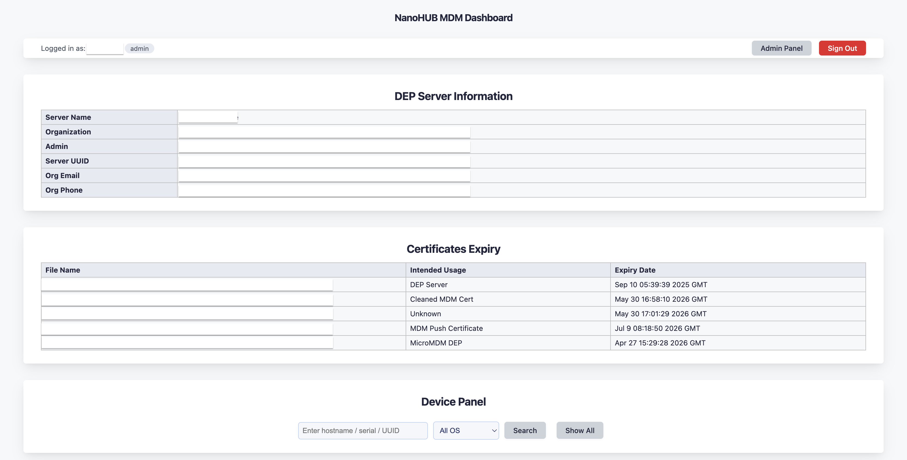
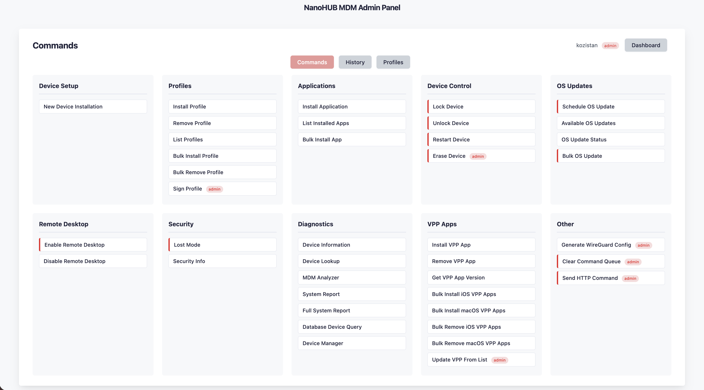
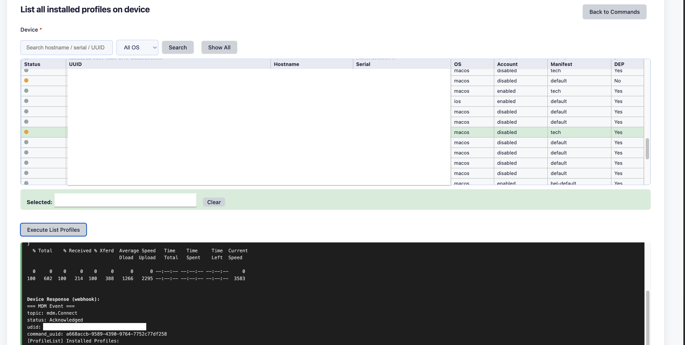

# NanoHUB MDM Dashboard

Web-based management dashboard for Apple MDM (Mobile Device Management) using NanoHUB backend with LDAP authentication and comprehensive admin panel.

**Version:** 1.6
**Last Updated:** 2025-12-17

## Features

### Core Features
- **LDAP Authentication**: Active Directory login with role-based access control
- **SQL-Based Device Management**: Fast, scalable MySQL device database
- **Real-time Device Status**: Online/Active/Offline status indicators
- **Device Search**: Search by UUID, serial number, or hostname
- **Parallel Execution**: 10-20x faster bulk operations with race condition fixes

### Admin Panel (39 commands, 10 categories)
- **Device Setup**: Automated installation workflows for new devices
- **Profiles**: Install, remove, list profiles (bulk operations supported)
- **Applications**: Install and manage applications
- **Device Control**: Lock, unlock, restart, erase devices
- **OS Updates**: Schedule and manage OS updates (with device selection, platform-specific options)
- **Remote Desktop**: Enable/disable remote access (including bulk operations)
- **Security**: Lost mode, security info
- **Diagnostics**: Device information, MDM analyzer, system reports
- **VPP Apps**: Volume Purchase Program app management
- **Database Tools**: Device inventory CRUD operations

### Role-Based Access Control

| AD Group | Role | Access |
|----------|------|--------|
| `it` | admin | Full access to all devices |
| `mdm-admin` | admin | Full access to all devices |
| `mdm-bel-admin` | bel-admin | Full access, filtered by manifest |
| `mdm-operator` | operator | Device management, profiles, apps |
| `mdm-report` | report | Read-only access |

### Advanced Features
- **Manifest Filtering**: Restrict admin access to specific device groups
- **Device Manager**: Add/Update/Delete devices via web interface
- **Audit Logging**: Complete audit trail for all admin actions
- **Bulk Operations**: Execute commands on multiple devices simultaneously
- **Parallel Execution**: All bulk scripts execute commands in parallel for 10-20x speed improvement
- **Bulk Remote Desktop**: Enable/disable Remote Desktop on multiple macOS devices with device selection

## Screenshots

### Main Dashboard


### Admin Panel


### Profile_list command on Admin Panel


## Architecture

```
┌─────────────────┐         ┌──────────────────┐         ┌─────────────────┐
│  Web Frontend   │────────▶│  Flask Web       │────────▶│   NanoMDM       │
│  (HTML/CSS/JS)  │         │  (nanohub_web)   │         │   Backend       │
└─────────────────┘         └──────────────────┘         └─────────────────┘
        │                           │
        │                   ┌───────┴───────┐
        │                   │               │
        ▼                   ▼               ▼
┌─────────────────┐  ┌─────────────┐  ┌─────────────┐
│  Admin Panel    │  │   LDAP/AD   │  │   MySQL     │
│  (nanohub_admin)│  │   Auth      │  │   Database  │
└─────────────────┘  └─────────────┘  └─────────────┘
```

## Prerequisites

- Python 3.8+
- MySQL/MariaDB database
- Active Directory (for LDAP authentication)
- Nginx (reverse proxy)
- NanoMDM server (running)
- systemd (service management)

## Installation

### 1. Clone Repository

```bash
git clone https://github.com/kozistan/nanohub-mdm-dashboard.git
cd nanohub-mdm-dashboard
```

### 2. Create Virtual Environment

```bash
python3 -m venv /opt/nanohub/venv
source /opt/nanohub/venv/bin/activate
pip install -r requirements.txt
```

### 3. Configure Environment

Create environment file `/opt/nanohub/backend_api/nanohub_environment`:

```bash
# LDAP Configuration
LDAP_HOST=dc01.example.com
LDAP_HOST_FAILOVER=dc02.example.com
LDAP_BIND_DN=CN=ldapadmin,OU=Admins,DC=example,DC=com
LDAP_BIND_PASSWORD=your_ldap_password
LDAP_BASE_DN=DC=example,DC=com

# Database Configuration
DB_HOST=localhost
DB_USER=nanohub
DB_PASSWORD=your_db_password
DB_NAME=nanohub

# Flask Configuration
FLASK_SECRET_KEY=your-secret-key-change-in-production

# Paths
DASHBOARD_INDEX_PATH=/var/www/mdm-web/index.html
PROFILES_DIR=/opt/nanohub/profiles/
COMMANDS_DIR=/opt/nanohub/tools/api/commands
```

### 4. Install Files

```bash
# Backend API
sudo mkdir -p /opt/nanohub/backend_api
sudo cp opt/nanohub/backend_api/*.py /opt/nanohub/backend_api/

# Web frontend
sudo mkdir -p /var/www/mdm-web/static
sudo cp var/www/mdm-web/index.html /var/www/mdm-web/
sudo cp var/www/mdm-web/static/dashboard.css /var/www/mdm-web/static/

# Systemd services
sudo cp etc/systemd/system/nanohub-web.service /etc/systemd/system/
sudo cp etc/systemd/system/mdm-flask-api.service /etc/systemd/system/
```

### 5. Set Permissions

```bash
# Environment file (contains secrets)
sudo chmod 600 /opt/nanohub/backend_api/nanohub_environment

# Backend files
sudo chmod 755 /opt/nanohub/backend_api/*.py

# Web files
sudo chmod 644 /var/www/mdm-web/index.html
sudo chmod 644 /var/www/mdm-web/static/dashboard.css
```

### 6. Configure Database

```sql
CREATE DATABASE IF NOT EXISTS nanohub;
CREATE USER IF NOT EXISTS 'nanohub'@'localhost' IDENTIFIED BY 'your_password';
GRANT ALL PRIVILEGES ON nanohub.* TO 'nanohub'@'localhost';

-- Device inventory table
CREATE TABLE IF NOT EXISTS device_inventory (
    id INT AUTO_INCREMENT PRIMARY KEY,
    uuid VARCHAR(255) UNIQUE NOT NULL,
    serial VARCHAR(255),
    os VARCHAR(50),
    hostname VARCHAR(255),
    manifest VARCHAR(100) DEFAULT 'default',
    account VARCHAR(100) DEFAULT 'disabled',
    dep VARCHAR(20) DEFAULT '0',
    created_at TIMESTAMP DEFAULT CURRENT_TIMESTAMP,
    updated_at TIMESTAMP DEFAULT CURRENT_TIMESTAMP ON UPDATE CURRENT_TIMESTAMP,
    INDEX idx_hostname (hostname),
    INDEX idx_serial (serial),
    INDEX idx_manifest (manifest)
);

-- Audit log table
CREATE TABLE IF NOT EXISTS admin_audit_log (
    id INT AUTO_INCREMENT PRIMARY KEY,
    timestamp TIMESTAMP DEFAULT CURRENT_TIMESTAMP,
    username VARCHAR(255),
    action VARCHAR(255),
    command VARCHAR(255),
    params TEXT,
    result TEXT,
    success BOOLEAN,
    INDEX idx_timestamp (timestamp),
    INDEX idx_username (username)
);
```

### 7. Configure Nginx

```nginx
server {
    listen 8000 ssl;
    server_name mdm.example.com;

    ssl_certificate /path/to/cert.pem;
    ssl_certificate_key /path/to/key.pem;

    # Flask Web Frontend (with LDAP auth)
    location / {
        proxy_pass http://127.0.0.1:9007;
        proxy_set_header Host $host;
        proxy_set_header X-Real-IP $remote_addr;
        proxy_set_header X-Forwarded-For $proxy_add_x_forwarded_for;
        proxy_set_header X-Forwarded-Proto $scheme;
    }

    # Static files
    location /static/ {
        alias /var/www/mdm-web/static/;
        expires 1d;
    }

    # API endpoints (for legacy compatibility)
    location /api/ {
        proxy_pass http://127.0.0.1:9006/api/;
        proxy_set_header Host $host;
        proxy_set_header X-Real-IP $remote_addr;
    }
}
```

### 8. Start Services

```bash
sudo systemctl daemon-reload
sudo systemctl enable nanohub-web mdm-flask-api
sudo systemctl start nanohub-web mdm-flask-api
sudo systemctl restart nginx

# Verify services
systemctl status nanohub-web mdm-flask-api
```

## Configuration

### LDAP Groups

Configure AD groups in `nanohub_ldap_auth.py`:

```python
GROUP_ROLE_MAPPING = {
    'it': 'admin',
    'mdm-admin': 'admin',
    'mdm-bel-admin': 'bel-admin',
    'mdm-operator': 'operator',
    'mdm-report': 'report',
}

# Manifest filters for restricted roles
ROLE_MANIFEST_FILTER = {
    'bel-admin': 'bel-%',  # Only sees devices with bel-* manifests
}
```

### Adding New Roles

To add a new restricted admin role:

1. Create AD group (e.g., `mdm-xyz-admin`)
2. Add to `GROUP_ROLE_MAPPING`: `'mdm-xyz-admin': 'xyz-admin'`
3. Add to `ROLE_PERMISSIONS`: `'xyz-admin': ['admin', 'operator', 'report', ...]`
4. Add manifest filter: `ROLE_MANIFEST_FILTER['xyz-admin'] = 'xyz-%'`
5. Update role hierarchy in `command_registry.py`
6. Restart nanohub-web service

## Usage

### Access Points

- **Main Dashboard**: `https://mdm.example.com:8000/`
- **Admin Panel**: `https://mdm.example.com:8000/admin`
- **Login**: `https://mdm.example.com:8000/login`

### Admin Panel Operations

1. Login with AD credentials
2. Navigate to Admin Panel
3. Select category and command
4. Fill in required parameters
5. Execute command
6. View results

### Device Manager

- **ADD**: Create new device in inventory
- **UPDATE**: Modify existing device properties
- **DELETE**: Remove device from inventory

### New Device Installation

Automated workflow for provisioning new devices:

1. Select branch location
2. Choose platform (macOS/iOS)
3. Select device
4. Configure optional settings (FileVault, WireGuard)
5. Execute - installs all required profiles and applications

## API Endpoints

### Authentication
- `GET /login` - Login page
- `POST /login` - Authenticate user
- `GET /logout` - Logout user
- `GET /auth/check` - Check authentication status

### Admin Panel
- `GET /admin` - Admin dashboard
- `POST /admin/execute` - Execute MDM command
- `GET /admin/api/devices` - Get all devices (with manifest filtering)
- `POST /admin/api/device-search` - Search devices

### Legacy API
- `GET /api/devices.json` - List all devices
- `POST /api/device-search` - Search device
- `GET /api/mdm-analyzer` - Device activity analysis

## Troubleshooting

### Service Issues

```bash
# Check service status
systemctl status nanohub-web
systemctl status mdm-flask-api

# View logs
journalctl -u nanohub-web -f
journalctl -u mdm-flask-api -f
```

### LDAP Issues

```bash
# Test LDAP connection
cd /opt/nanohub/backend_api
source /opt/nanohub/venv/bin/activate
python3 -c "from nanohub_ldap_auth import test_ldap_connection; test_ldap_connection()"
```

### Database Issues

```bash
# Test database connection
mysql -h localhost -u nanohub -p nanohub -e "SELECT COUNT(*) FROM device_inventory"
```

## Security Considerations

- Use HTTPS with valid SSL certificates
- Store credentials in environment file with restricted permissions (600)
- Use read-only database user for report queries
- Restrict Flask API to localhost
- Enable audit logging
- Regularly review audit logs

## MDM Profiles

MDM configuration profiles are **not included** in this repository. You must create and sign your own profiles.

### Profile Locations

```
/opt/nanohub/profiles/                    # Standard profiles
/opt/nanohub/profiles/wireguard_configs/  # WireGuard VPN profiles
```

### Profile Requirements

- **Only signed profiles** (`.signed.mobileconfig`) are displayed in the Admin Panel GUI
- Profiles must be signed with a valid Apple-trusted certificate
- Unsigned profiles will not appear in the profile selection dropdown

### Profile Naming Convention

```
company.macos.ProfileName.profile.signed.mobileconfig   # macOS profiles
company.ios.ProfileName.profile.signed.mobileconfig     # iOS profiles
```

### Signing Profiles

Use Apple Configurator 2 or a signing tool to sign profiles:

```bash
# Example using openssl (requires Apple Developer certificate)
security cms -S -N "Your Signing Identity" -i unsigned.mobileconfig -o signed.mobileconfig
```

## Files Structure

```
/opt/nanohub/
├── backend_api/
│   ├── nanohub_web.py          # Main Flask web frontend
│   ├── nanohub_ldap_auth.py    # LDAP authentication module
│   ├── nanohub_admin.py        # Admin panel module
│   ├── command_registry.py     # MDM command definitions
│   ├── mdm-flask-api_wrappper.py # Legacy API wrapper
│   └── nanohub_environment     # Environment configuration
├── profiles/                   # MDM configuration profiles (not in repo)
│   └── wireguard_configs/      # WireGuard VPN profiles (not in repo)
├── tools/api/commands/         # MDM command scripts
└── venv/                       # Python virtual environment

/var/www/mdm-web/
├── index.html                  # Main dashboard
└── static/
    └── dashboard.css           # Stylesheet

/etc/systemd/system/
├── nanohub-web.service         # Web frontend service
└── mdm-flask-api.service       # Legacy API service
```

## Contributing

1. Fork the repository
2. Create feature branch (`git checkout -b feature/amazing-feature`)
3. Commit changes (`git commit -m 'Add amazing feature'`)
4. Push to branch (`git push origin feature/amazing-feature`)
5. Open Pull Request

## License

MIT License - See LICENSE file for details.

## Acknowledgments

- Built on NanoMDM by micromdm
- Uses Flask web framework
- ldap3 for Active Directory authentication
- Frontend with vanilla JavaScript (no frameworks)
